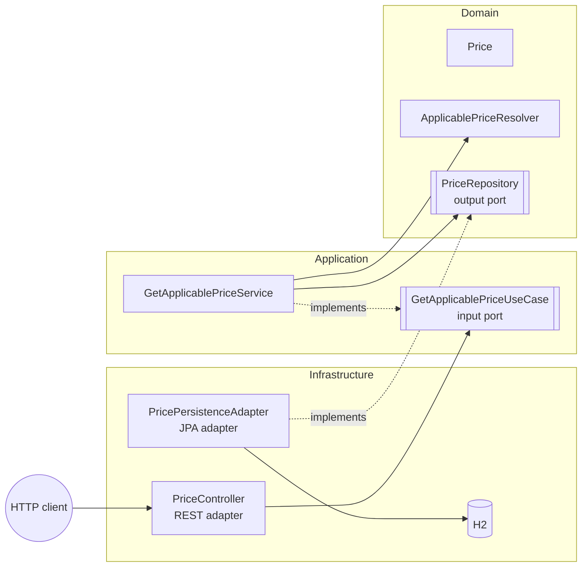

# Price Service

REST service that returns the **final price** to apply to a product of a brand at a given date.
Built with **Java 21**, **Spring Boot 4** and **Hexagonal Architecture**.

---

## Table of contents

- [The problem](#the-problem)
- [Tech stack](#tech-stack)
- [Getting started](#getting-started)
- [API](#api)
- [Architecture](#architecture)
- [Design decisions](#design-decisions)
- [Testing](#testing)
- [Git workflow](#git-workflow)
- [AI-assisted development](#ai-assisted-development)

---

## The problem

The e-commerce database stores a `PRICES` table with the price lists (tariffs) that a brand applies
to a product within a date range. Several price lists may overlap in time; in that case the one
with the **highest priority** wins.

| BRAND_ID | START_DATE          | END_DATE            | PRICE_LIST | PRODUCT_ID | PRIORITY | PRICE | CURR |
|---------:|---------------------|---------------------|-----------:|-----------:|---------:|------:|------|
| 1        | 2020-06-14 00:00:00 | 2020-12-31 23:59:59 | 1          | 35455      | 0        | 35.50 | EUR  |
| 1        | 2020-06-14 15:00:00 | 2020-06-14 18:30:00 | 2          | 35455      | 1        | 25.45 | EUR  |
| 1        | 2020-06-15 00:00:00 | 2020-06-15 11:00:00 | 3          | 35455      | 1        | 30.50 | EUR  |
| 1        | 2020-06-15 16:00:00 | 2020-12-31 23:59:59 | 4          | 35455      | 1        | 38.95 | EUR  |

The service receives an **application date**, a **product id** and a **brand id**, and returns the
product id, brand id, price list, application date range and final price.

### Business rules

1. A price is applicable when `START_DATE <= applicationDate <= END_DATE` (both boundaries inclusive).
2. Among the applicable prices, the one with the highest `PRIORITY` wins.
3. On a priority tie (not present in the sample data), the price with the most recent `START_DATE`
   wins, so the result is always deterministic.
4. If no price applies, the service answers `404 Not Found`.

---

## Tech stack

| Concern    | Choice                                                       |
|------------|--------------------------------------------------------------|
| Language   | Java 21 (records, text blocks)                               |
| Framework  | Spring Boot 4 (Web MVC, Data JPA)                            |
| Database   | H2 in-memory, initialised with `schema.sql` and `data.sql`   |
| API docs   | springdoc-openapi (Swagger UI)                               |
| Errors     | RFC 9457 Problem Details (`application/problem+json`)        |
| Testing    | JUnit Jupiter, AssertJ, Mockito, MockMvc, `@DataJpaTest`     |
| Build      | Maven (wrapper included)                                     |

---

## Getting started

### Prerequisites

- JDK 21

Maven does not need to be installed: the project includes the Maven Wrapper
(`mvnw` on Linux/macOS, `mvnw.cmd` on Windows).

### Run the application

```bash
./mvnw spring-boot:run
```

The service starts on `http://localhost:8080`.

| Resource   | URL                                                                                          |
|------------|----------------------------------------------------------------------------------------------|
| Swagger UI | http://localhost:8080/swagger-ui.html                                                        |
| OpenAPI    | http://localhost:8080/v3/api-docs                                                            |
| H2 console | http://localhost:8080/h2-console (JDBC URL `jdbc:h2:mem:pricingdb`, user `sa`, no password) |

### Run the tests

```bash
./mvnw test
```

---

## API

### `GET /api/v1/prices`

| Query parameter   | Type                         | Required | Example               |
|-------------------|------------------------------|----------|-----------------------|
| `applicationDate` | ISO-8601 date-time           | yes      | `2020-06-14T16:00:00` |
| `productId`       | positive integer             | yes      | `35455`               |
| `brandId`         | positive integer             | yes      | `1`                   |

**Request**

```bash
curl "http://localhost:8080/api/v1/prices?applicationDate=2020-06-14T16:00:00&productId=35455&brandId=1"
```

**200 OK**

```json
{
  "productId": 35455,
  "brandId": 1,
  "priceList": 2,
  "startDate": "2020-06-14T15:00:00",
  "endDate": "2020-06-14T18:30:00",
  "price": 25.45,
  "currency": "EUR"
}
```

### Errors

Every error is handled explicitly by `GlobalExceptionHandler` and returned with the same structure
(`application/problem+json`):

| Status | Title                   | When                                                          |
|--------|-------------------------|---------------------------------------------------------------|
| 400    | `Invalid request`       | A parameter is missing, has the wrong type or is not positive |
| 404    | `Price not found`       | No price applies to the product and brand at that date        |
| 404    | `Resource not found`    | The requested path does not exist                             |
| 405    | `Method not allowed`    | The HTTP method is not supported by the endpoint              |
| 500    | `Internal server error` | Unexpected error (internal details are never exposed)         |

**404 Not Found**

```json
{
  "type": "about:blank",
  "title": "Price not found",
  "status": 404,
  "detail": "No applicable price found for brand 1, product 35455 at 2019-01-01T00:00",
  "instance": "/api/v1/prices"
}
```

**400 Bad Request**

```json
{
  "type": "about:blank",
  "title": "Invalid request",
  "status": 400,
  "detail": "Required parameter 'brandId' is missing",
  "instance": "/api/v1/prices"
}
```

Other `400` details:

- `Parameter 'applicationDate' has an invalid value: '14/06/2020'`
- `brandId must be a positive number`

---

## Architecture

The project follows **Hexagonal Architecture (Ports & Adapters)**. Dependencies always point
inwards: infrastructure → application → domain. The domain and application layers are plain Java,
with no Spring or JPA dependencies.



```
src/main/java/com/ecommerce/price_service
├── PriceServiceApplication.java
├── domain                              # Business rules, plain Java
│   ├── model/Price                     # Immutable record with invariants and applicability rule
│   ├── service/ApplicablePriceResolver # Priority resolution algorithm (Streams)
│   ├── repository/PriceRepository      # Output port
│   └── exception/PriceNotFoundException
├── application                         # Use case orchestration, plain Java
│   ├── GetApplicablePriceService       # Use case implementation
│   ├── port/in/GetApplicablePriceUseCase   # Input port
│   ├── port/in/GetApplicablePriceQuery     # Validated input of the use case
│   └── exception/InvalidPriceQueryException
└── infrastructure                      # Framework-specific code
    ├── adapter/in/rest
    │   ├── controller/PriceController
    │   ├── dto/PriceResponse
    │   ├── mapper/PriceRestMapper
    │   └── GlobalExceptionHandler
    ├── adapter/out
    │   ├── PricePersistenceAdapter     # Implements the PriceRepository port
    │   ├── entity/PriceEntity
    │   ├── mapper/PriceEntityMapper
    │   └── repository/SpringDataPriceRepository
    └── config/BeanConfiguration        # Registers domain and application classes as beans
```

### Request flow

1. `PriceController` receives the HTTP request and builds a `GetApplicablePriceQuery`, which
   validates its own input.
2. `GetApplicablePriceService` asks the `PriceRepository` port for the candidate prices.
3. `PricePersistenceAdapter` queries H2 through Spring Data JPA and maps entities to `Price`.
4. `ApplicablePriceResolver` picks the winning price.
5. `PriceRestMapper` converts the result into a `PriceResponse`.

---

## Design decisions

- **Framework-free core.** Domain and application classes carry no Spring annotations. They are
  registered as beans in `BeanConfiguration`, so the business logic can be tested with plain JUnit.
- **Priority resolution as a domain service.** The rule *"if several prices overlap, the highest
  priority wins"* is defined by the business itself, so it belongs to the domain rather than to the
  orchestration in the application layer. `ApplicablePriceResolver` is stateless, performs no I/O and
  only works with domain objects. The application service fetches the candidates through the port
  and delegates the decision to the domain. Keeping the rule here, instead of in an
  `ORDER BY ... LIMIT 1` query, makes it explicit and unit-testable.
- **Deterministic tie-breaking.** Equal priorities do not appear in the sample data but are possible
  in real data, so ties are broken by the most recent start date.
- **Validation owned by the application.** `GetApplicablePriceQuery` validates that identifiers are
  positive and that the date is present, throwing `InvalidPriceQueryException`. The rule is not
  delegated to framework annotations and is covered by unit tests.
- **Explicit error handling.** `GlobalExceptionHandler` declares a handler for every expected
  exception, including the request errors raised by Spring (missing parameter, type mismatch,
  unknown path, unsupported method), so all errors share the same Problem Details structure.
  A catch-all handler logs unexpected errors without exposing internal details to the client.
- **Separate models per layer.** `PriceEntity` (persistence), `Price` (domain) and `PriceResponse`
  (API) are distinct types connected by mappers, so changes in one layer do not leak into another.
- **Audit columns stay out of the domain.** The provided dataset includes `LAST_UPDATE` and
  `LAST_UPDATE_BY`. They are stored in the table but not mapped in the entity or the domain model,
  since they play no role in the pricing rules.
- **Explicit schema.** `schema.sql` defines the table and Hibernate schema generation is disabled
  (`ddl-auto: none`), so the database contract is visible and reviewable.
- **Monetary values.** Prices use `BigDecimal` and currencies use `java.util.Currency`.

---

## Testing

```bash
./mvnw test
```

| Level       | Class                            | What it covers                                                                 |
|-------------|----------------------------------|--------------------------------------------------------------------------------|
| Unit        | `PriceTest`                      | Invariants and inclusive date boundaries                                       |
| Unit        | `ApplicablePriceResolverTest`    | Streams algorithm: priority, input order, filtering, tie-breaking, null values |
| Unit        | `GetApplicablePriceServiceTest`  | Use case orchestration with a mocked output port                               |
| Unit        | `GetApplicablePriceQueryTest`    | Validation of identifiers and application date                                 |
| Unit        | `GlobalExceptionHandlerTest`     | Mapping of every exception to its Problem Details response                     |
| Unit        | `PriceRestMapperTest`            | Domain → API response mapping                                                  |
| Unit        | `PriceEntityMapperTest`          | Entity → domain mapping, currency trimming and invalid currencies              |
| Slice       | `PricePersistenceAdapterTest`    | JPA query and mapping against H2 (`@DataJpaTest`)                              |
| Integration | `PriceControllerIntegrationTest` | The 5 required scenarios end-to-end, plus 400 and 404 response bodies          |

### Required scenarios (product `35455`, brand `1`)

| Test | Application date | Expected price list | Expected price |
|------|------------------|--------------------:|---------------:|
| 1    | 2020-06-14 10:00 | 1                   | 35.50 EUR      |
| 2    | 2020-06-14 16:00 | 2                   | 25.45 EUR      |
| 3    | 2020-06-14 21:00 | 1                   | 35.50 EUR      |
| 4    | 2020-06-15 10:00 | 3                   | 30.50 EUR      |
| 5    | 2020-06-16 21:00 | 4                   | 38.95 EUR      |

---

## Git workflow

- The project bootstrap was committed directly to `main`.
- The implementation was developed on `feature/price-service`, one commit per layer from the inside
  out (domain → application → infrastructure), and merged through a pull request.
- The changes were made on `fix/review` and merged through a
  second pull request.
- Commits follow [Conventional Commits](https://www.conventionalcommits.org), and pull requests are
  merged with a merge commit (not squashed) to preserve the history.

```bash
git log --oneline --graph
```

---

## AI-assisted development

Claude (Anthropic) was used as an AI pair-programming assistant throughout the exercise: to evaluate design alternatives for the hexagonal architecture, to enumerate test cases, to troubleshoot framework and environment issues, and to review the repository against the requirements. Every suggestion was reviewed, adapted and validated by the test suite before being committed.

Details, and what was decided or changed in each case, are documented in
[`docs/AI_USAGE.md`](docs/AI_USAGE.md).
